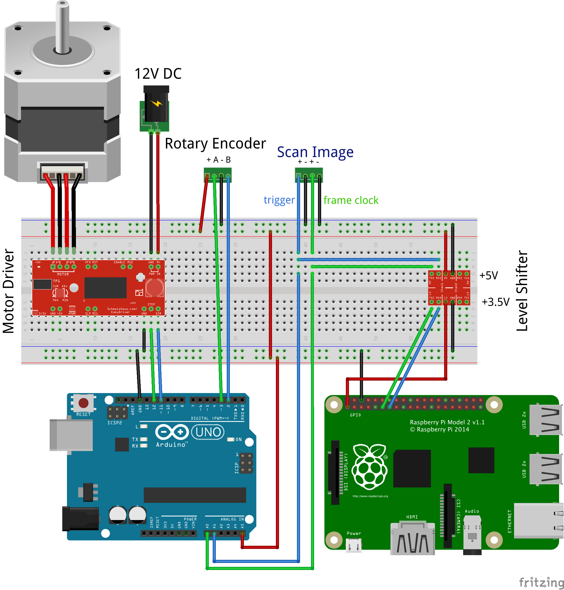

# Introduction

This is documentation for controlling a behavioral experiment using an Arduino microcontroller with a Python based web interface. First, we document building an Arduino controlled motorized circular treadmill. Next, we provide Python source code to control an experiment through a web-browser. Our aim is to provide a starting point for open-source behavioral experiments that can be extended to new experimental designs. Please see the accompanying [manuscript](manuscript.md).

<a name="webinterface"></a>


**Figure 1. Web-browser interface.**

The top section provides an interface to start/stop a trial and plots real-time feedback as the trial is running.

The **Stimulus** section provides an interface to set stimulus parameters for a trial and to upload these parameters to an Arduino. This section also provides a plot of what the trial will look like based on the set of stimulus parameters entered (this plot is not shown in this example).

<BR CLEAR="ALL"/>

##  System design

The core system consists of an Arduino, a stepper motor and motor driver, and a rotary encoder. The system comes together with a circular [treadmill](images.md) that is driven by the stepper motor and whos position is recorded with the rotary encoder. Finally, a host computer to program the Arduino and control an experiment is needed. Any computer running Matlab should suffice. We strongly recommend using a Linux based Raspberry Pi to take full advantage of the provided Python code including code to synchronize running the treadmill with video acquisition.

The Arduino can be controlled with serial commands and can be triggered with general purpose TTL pulses. By relying on serial commands and TTL pulses, this system is not dependent on the details of other pieces of equipment for the experiment and can be extended to new and unique experimental configurations.

For example, we are routinely using the treadmill while simultaneously acquiring in vivo two-photon images using ScanImage software (in Matlab) with National Instruments data acquisition cards.

See the [parts list](parts.md) for a full list of parts, prices, and links to buy online.

### Arduino

The majority of Arduino compatible micro-controllers will work with the code provided. We suggest you start by using an Arduino [Uno][35]. Two alternative micro-controllers are the [Mega][48] and the [Teensy][49]. Both of these boards provide more low-level interrupts and have more memory than an Uno. In addition, the Teensy has a more advanced and faster Arm Cortex processor over the ATmega in the Uno and Mega.

- [Arduino Uno][35], [Sparkfun][36], [Adafruit][37], $25
- Stepper Motor, [Sparkfun - 09238][7], $15
- Stepper motor driver, EasyDriver, [Sparkfun - 12779][8], $15. Main website for [EasyDriver][9]
- Rotary encoder, [Honeywell-600-128-CBL][10], [.pdf][11] spec sheet, $37

### Raspberry Pi

The [Raspberry Pi][38] is a fully functional credit-card sized computer with USB, Ethernet, Wifi, and HDMI ports. It can be used as a host computer to program an Arduino using the Arduino IDE. A truly unique feature of the Pi is that it has built in digital IO (DIO). Thus, a Raspberry Pi can send/receive TTL signals to/from most laboratory equipment including an Arduino. The Pi can be equipped with a dedicated video camera (5MP or 8MP) that can be controlled from Python and can be precisely triggered by TTL pulses using DIO ports. Given its small footprint, a Raspberry Pi is easily integrated into the same electronics box as the Arduino.

- [Raspberry Pi][38], [AdaFruit][39], [Element14][40], $40
- [Pi NoIR][43] 5MP Camera, [Adafruit][44], [Element14][45], $30
- IR LED, 840-850 nm, [Sparkfun - 9469][12] $1 each (960 nm IR LEDs do not work well with Pi NoIR camera)
- 4-channel Logic Level Converter (Bi-Directional), [Sparkfun][41], [Adafruit][42], $4

One caveat is the the DIO ports on the Pi can only handle 3.5V TTL pulses while most laboratory equipment (including most Arduinos and National Instruments boards) use 5V TTL pulses. Thus, a logic-level converter is needed to convert between 3.5V on the Pi to the standard 5V for other equipment. 

###  Wiring the system

- Wire the stepper motor to the motor driver
- Wire the Arduino to the motor driver
- Wire the rotary encoder to the Arduino
- Wire the Arduino to Scan Image
- Optionally, wire the Raspberry Pi to Scan Image via a 3.5V to 5V level shifter

<A HREF="img/treadmill_bb.png"></A>

### Treadmill

See the [images](images.md) page and the [treadmill section](parts.md#treadmill) of the parts list.

Finding the building blocks for hardware can be time-consuming and frustrating. A good starting point is to use **Actobotics** parts from [ServoCity][13] or [Sparkfun][14]. In particular, [ServoCity][15], has made a useful set of visual guides and project ideas that are really helpful in designing hardware components. Structural components include: frames, rods, bearings, clamps, and motor mounts.

## Upload code to the Arduino

###  Required libraries

You want to use these non-blocking libraries otherwise your code will not perform well. If you don't use these libraries then code to turn the stepper motor will block other code like reading the rotary encoder. 

- [AccelStepper][16] library to control stepper motor

- Rotary encoder library from [PJRC][17]

###  Arduino IDE

The source code for the Arduino can be found in [/arduino/src/treadmill.cpp][4].

Use the standard Arduino IDE to upload treadmill.cpp to your Arduino. Make sure you have the required Arduino libraries installed. Also be sure you understand how to activate addition [low level interrupts](index.md#lowlevelinterrupts) if using an Arduino Uno.

### Platformio

If you prefer you can use [Platformio][5] to do everything from a command line. This has the distinct advantage that you can compile and upload code from a headless computer including a Raspberry Pi or any system running Linux.

Install platformio

    pip install platformio

Initialize a Platformio project and specify compilation for Arduino Uno

	platformio init --board uno # arduino uno

Put treadmill.cpp into platformio /src/ folder

Tweek platformio.ini

    [env:uno]
    platform = atmelavr
    framework = arduino
    board = uno
    build_flags = -D _expose_interrupts_ #creates compiler directive

Compile and upload code

    platformio run #compile arduino code
    platformio run --target upload #compile and upload
    platformio run --target clean #clean project 

Open a serial port with platformio

    platformio serialports monitor -p /dev/ttyUSB0 -b 115200 #a serial port monitor

Specify the correct serial port

    #serialStr = '/dev/tty.usbmodem618661' #teensy at work
    #serialStr = '/dev/tty.usbmodem618661' #teensy?
    #serialStr = '/dev/ttyUSB0' #hand soldered arduino micro (home debian)
    #serialStr = '/dev/tty.usbserial-A50285BI' # hand soldered at work
    serialStr = '/dev/ttyACM0' #uno

<a name="lowlevelinterrupts"></a>
### Low Level Interrupts

The Arduino Uno only comes with two pins (2 and 3) capable of low-level interrupts and more pins need to be broken out. We need two low level interrupts for the Rotary Encoder, another for a TTL trigger and another for TTL pulses coming from a frame clock.

See [Pin-change interrupts][25] for information on exposing additional pins as low-level interrupts.

We have included a compiler directive `_expose_interrupts_` in treadmill.cpp that if activated will run code to expose additional interrupts. 

- If using platformio this is taken care of in the [env] section of platformio.ini
- If using the arduino IDE, `define _expose_interrupts_ = 1` must be included in [treadmill.cpp][4]

```
//Uncomment this line if running on an Arduino Uno and compiling with the arduino IDE
//#define _expose_interrupts_ 1
```

## Python server setup

Download and install [Anaconda][1]. Anaconda is a [python][2] installation that will install many commonly used libraries. It is much easier to get started with Anaconda rather than a basic installation of Python.

###  Python libraries

Install additional required python libraries using the included requirements.txt file

`pip install -r requirements.txt`

Here is the requirements.txt file

```
eventlet>=0.18.4
Flask>=0.10.1
Flask-Markdown>=0.3
Flask-SocketIO>=1.0
platformio>=2.8.5
plotly>=1.9.6
pyserial>=3.0.1
```
Required python libraries on Raspberry Pi

`pip install -r raspberry_requirements.txt`

```
picamera
RPi.GPIO
```

## Running an experiment

At its core, an experiment is run on the Arduino using [treadmill.cpp][4]. We have provided two additional interfaces: a python interface and a web based interface.

You can roll your own interface by interfacing directly with the Arduino code in [treadmill.cpp][4], the python code in [treadmill.py][19], or the web server code in [treadmill_app.py][18].

###  Arduino interface

The Arduino program [treadmill.cpp][4] provides a simple serial interface to get and set parameters of a trial and to start and stop a trial. Once the program is uploaded to an Arduino, open your favorite serial port and start entering commands.

```
startTrial # start a trial
stopTrial # stop a trial
getState # 
settrial,[name],[value]
```

`settrial` takes the `name` and `value` of a trial parameter to set. The `name` needs to be one of: numPulse, numEpoch, epochDur, preDur, etc. These names match the 'Stimulus' parameters provided in the web interface. See the SetTrial() function in [treadmill.cpp][4] for all possible trial parameters.

Entering `getState` in a serial window and the Arduino will return the current values for all trial parameters. This is also a good way to find the names of trial parameters and then set them like `settrial,epochDur,5000`.

```
=== Arduino State ===
trialNumber=0
trialDur=1000
numEpoch=1
epochDur=1000
preDur=1000
postDur=1000
numPulse=3
pulseDur=1000
useMotor=1
motorDel=200
motorDur=200
motorSpeed=0
motorMaxSpeed=0
versionStr=20160322
=== Done ===
```

###  Python interface
You can  use [iPython/Jupyter][47] or any Python command interpreter to drive an experiment. You can also write your own python code to interface with the core python code in [treadmill.py][19].

Here is a short example of running an experiment in Python

```python
import treadmill
t = treadmill.treadmill() # create a treadmill object
t.startTrial() # start a new trial
t.stopTrial() # stop a trial
t.GetArduinoState() # get the current state with all trial parameters (see Arduino getstate below).
t.settrial('epochDur',5000) # set the value of 'epochDur' trial parameter to 5000 ms
t.startTrial() # start a new trial
```

The python interface and arduino interface share all trial parameter names.

###  Web interface

A [web interface](index.md#webinterface) is provided in [treadmill_app.py][18]. This uses the [Flask][26] python library. Flask is a micro-framework that allows a web-server to be created and controlled all from within python.

Run the web interface with `python treadmill_app.py`. You can change the default IP address and port of the web server in [treadmill_app.py][18].

- To run the web server on the machines local network IP, port 5010

    >socketio.run(app, host='0.0.0.0', port=5010, use_reloader=True)

- To run the web server on localhost 127.0.0.1:5010, use this if using a single machine (no LAN needed)

    >socketio.run(app, host='', port=5010, use_reloader=True)

#### Client side 

The [web interface](index.md#webinterface) that is served by Flask is using a number of client and server libraries. See [index.html][33] and [analysis2.html][34] for client-side code.

- [Socket-io][28] allows the flask server to push updates to web-page without reloading the page
- [Bootstrap][27] for page layout, buttons, sliders, value display
- [jquery][32] to handle logic of user interface
- [plotly.js][29] to plot the arduino stimulus
- [highcharts.js][30] to plot a trial while it is running
- [jqgrid][31] to display a table of trials from disk


[1]: https://www.continuum.io/why-anaconda
[2]: http://www.python.org/

[3]:https://github.com/cudmore/treadmill/blob/master/requirements.txt
[4]: https://github.com/cudmore/treadmill/blob/master/arduino/src/treadmill.cpp
[5]: http://platformio.org/
[6]: http://docs.platformio.org/en/latest/quickstart.html#initialize-project

[7]: https://www.sparkfun.com/products/9238
[8]: https://www.sparkfun.com/products/12779
[9]: http://www.schmalzhaus.com/EasyDriver/
[10]: http://www.digikey.com/product-detail/en/600128CBL/600CS-ND/53504
[11]: http://sensing.honeywell.com/600%20series_005940-2-en_final_12sep12.pdf
[12]: https://www.sparkfun.com/products/9469
[13]: https://www.servocity.com/html/actoboticstm.html
[14]: https://www.sparkfun.com/actobotics
[15]: https://www.servocity.com/html/actoboticstm.html
[16]: http://www.airspayce.com/mikem/arduino/AccelStepper/classAccelStepper.html
[17]: https://www.pjrc.com/teensy/td_libs_Encoder.html

[18]: https://github.com/cudmore/treadmill/blob/master/treadmill_app.py
[19]: https://github.com/cudmore/treadmill/blob/master/treadmill.py

[20]: https://flask-socketio.readthedocs.org/en/latest/
[21]: http://eventlet.net/
[22]: https://pythonhosted.org/pyserial/shortintro.html
[23]: https://pythonhosted.org/Flask-Markdown/
[24]: http://docs.platformio.org/en/latest/userguide/cmd_serialports.html#platformio-serialports-monitor
[25]: http://www.geertlangereis.nl/Electronics/Pin_Change_Interrupts/PinChange_en.html
[26]: http://flask.pocoo.org

[27]: http://getbootstrap.com
[28]: https://flask-socketio.readthedocs.org/en/latest/
[29]: https://plot.ly/javascript/
[30]: http://www.highcharts.com
[31]: http://www.trirand.com/blog/
[32]: https://jquery.com
[33]: https://github.com/cudmore/treadmill/blob/master/templates/index.html
[34]: https://github.com/cudmore/treadmill/blob/master/templates/analysis2.html
[35]: https://www.arduino.cc/en/main/arduinoBoardUno
[36]: https://www.sparkfun.com/products/11021
[37]: https://www.adafruit.com/products/50
[38]: https://www.raspberrypi.org/products/
[39]: https://www.adafruit.com/category/105
[40]: https://www.element14.com/community/community/raspberry-pi
[41]: https://www.sparkfun.com/products/12009
[42]: https://www.adafruit.com/products/757
[43]: https://www.raspberrypi.org/products/pi-noir-camera/
[44]: https://www.adafruit.com/product/1567
[45]: https://www.element14.com/community/search.jspa?q=pi+noir
[46]: https://github.com/cudmore/treadmill/blob/master/VideoServer.py
[47]: https://ipython.org
[48]: https://www.arduino.cc/en/Main/arduinoBoardMega2560
[49]: https://www.pjrc.com/store/teensy32.html